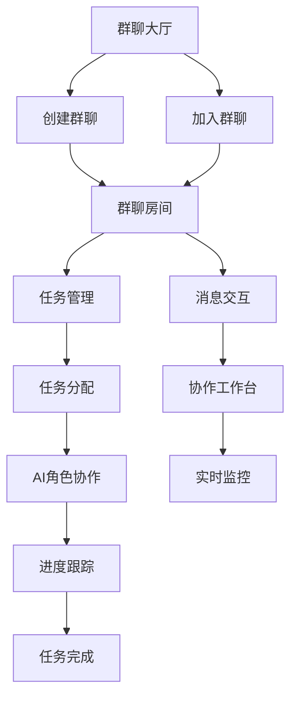

# 群聊与多人互动功能需求文档

## 1. 产品概述

本功能旨在为七个儿子AI助手平台增加群聊与多人协作能力，让用户能够创建群聊房间，邀请多个AI角色共同参与任务讨论和协作。通过智能任务分配和实时协作机制，提升复杂任务的处理效率和质量。

* 核心价值：通过多AI角色协作，解决单一AI角色难以处理的复杂任务，提供更全面的解决方案

* 目标用户：需要处理复杂项目、多领域协作的用户，如项目经理、创业者、研究人员等

* 市场价值：填补AI协作领域的空白，为用户提供独特的多AI协同工作体验

## 2. 核心功能

### 2.1 用户角色

| 角色    | 注册方法      | 核心权限                  |
| ----- | --------- | --------------------- |
| 普通用户  | 邮箱注册      | 创建群聊、邀请AI角色、分配任务、查看进度 |
| 群聊管理员 | 创建群聊自动获得  | 管理群聊成员、设置群聊规则、删除群聊    |
| AI角色  | 系统预设或用户创建 | 接收任务、参与讨论、协作完成任务、状态汇报 |

### 2.2 功能模块

群聊与多人互动功能包含以下主要页面：

1. **群聊大厅页面**：群聊列表展示、创建新群聊、搜索和筛选功能
2. **群聊房间页面**：实时消息交互、AI角色状态显示、任务面板
3. **任务管理页面**：任务创建、分配、进度跟踪、依赖关系管理
4. **协作工作台页面**：多角色协作视图、任务流程图、实时状态监控

### 2.3 页面详情

| 页面名称    | 模块名称   | 功能描述                      |
| ------- | ------ | ------------------------- |
| 群聊大厅页面  | 群聊列表   | 显示用户参与的所有群聊，支持搜索和分类筛选     |
| 群聊大厅页面  | 创建群聊   | 创建新群聊房间，设置群聊名称、描述、邀请AI角色  |
| 群聊大厅页面  | 快速加入   | 通过邀请码或链接快速加入群聊            |
| 群聊房间页面  | 消息区域   | 实时显示用户和AI角色的消息，支持文本、图片、文件 |
| 群聊房间页面  | 角色面板   | 显示群聊中所有AI角色的状态、专长、当前任务    |
| 群聊房间页面  | 任务快捷操作 | 快速创建任务、分配给角色、查看任务进度       |
| 任务管理页面  | 任务看板   | 以看板形式展示任务状态（待办、进行中、已完成）   |
| 任务管理页面  | 任务分配   | 将任务分配给特定AI角色，设置优先级和截止时间   |
| 任务管理页面  | 进度跟踪   | 实时查看任务执行进度，AI角色工作状态更新     |
| 协作工作台页面 | 协作视图   | 多角色协作的可视化界面，显示角色间交互       |
| 协作工作台页面 | 任务流程图  | 展示任务依赖关系和执行流程             |
| 协作工作台页面 | 实时监控   | 监控AI角色工作状态、任务执行效率、协作质量    |

## 3. 核心流程

### 用户操作流程

**群聊创建与管理流程：**

1. 用户进入群聊大厅 → 点击"创建群聊" → 设置群聊信息 → 选择邀请的AI角色 → 创建成功进入群聊房间

**任务协作流程：**

1. 在群聊房间中描述需求 → 创建任务并分解为子任务 → 分配给不同AI角色 → AI角色开始协作 → 实时查看进度 → 任务完成汇总

**AI角色协作流程：**

1. 接收任务分配 → 分析任务需求 → 与其他角色协商 → 执行任务并汇报进度 → 协作完成最终目标

## 4. 用户界面设计

### 4.1 设计风格

* **主色调**：深蓝色 (#1e40af) 和浅蓝色 (#3b82f6)，体现专业和协作感

* **辅助色**：绿色 (#10b981) 表示在线状态，橙色 (#f59e0b) 表示进行中任务

* **按钮风格**：圆角矩形，带有微妙阴影和悬停效果

* **字体**：主要使用 16px 的无衬线字体，标题使用 18-24px

* **布局风格**：卡片式布局，左侧导航 + 主内容区域的经典布局

* **图标风格**：使用 Lucide React 图标库，简洁现代的线性图标

### 4.2 页面设计概览

| 页面名称    | 模块名称 | UI元素                                   |
| ------- | ---- | -------------------------------------- |
| 群聊大厅页面  | 群聊列表 | 卡片式群聊展示，包含群聊头像、名称、最后消息、在线角色数量，悬停效果     |
| 群聊大厅页面  | 创建群聊 | 模态框形式，包含表单输入、AI角色选择器、创建按钮              |
| 群聊房间页面  | 消息区域 | 聊天气泡样式，用户消息右对齐（蓝色），AI角色消息左对齐（灰色），时间戳显示 |
| 群聊房间页面  | 角色面板 | 右侧边栏，显示角色头像、状态指示灯、专长标签、当前任务进度条         |
| 任务管理页面  | 任务看板 | 三列布局（待办/进行中/已完成），拖拽式任务卡片，颜色编码优先级       |
| 协作工作台页面 | 协作视图 | 网络图形式展示角色协作关系，实时连线动画，状态颜色编码            |

### 4.3 响应式设计

* **桌面优先**：主要针对桌面端设计，支持大屏幕多窗口协作

* **移动适配**：在移动端采用底部导航，折叠侧边栏，简化协作视图

* **触摸优化**：支持触摸拖拽任务卡片，手势操作消息滚动

## 5. 技术实现要点

### 5.1 实时通信机制

* 使用 WebSocket 实现实时消息推送

* 支持断线重连和消息缓存

* AI角色状态变化实时同步

### 5.2 数据结构设计

* 群聊房间：包含成员列表、消息历史、任务关联

* 任务系统：支持任务分解、依赖关系、进度跟踪

* 角色协作：记录角色间交互历史和协作效果

### 5.3 AI协作引擎

* 任务智能分解和分配算法

* 角色间通信协议设计

* 协作效果评估和优化机制

