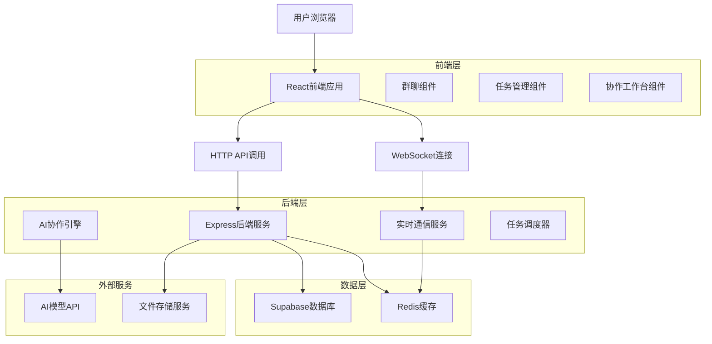

# 群聊与多人互动技术架构文档

## 1. 架构设计



## 2. 技术描述

- **前端**: React@18 + TypeScript + Tailwind CSS + Socket.io-client
- **后端**: Express@4 + Socket.io + TypeScript
- **数据库**: Supabase (PostgreSQL)
- **缓存**: Redis
- **实时通信**: WebSocket (Socket.io)
- **AI服务**: OpenAI/Anthropic API集成

## 3. 路由定义

| 路由 | 用途 |
|------|------|
| /chat-rooms | 群聊大厅页面，显示所有群聊房间 |
| /chat-rooms/create | 创建新群聊页面 |
| /chat-rooms/:id | 群聊房间页面，实时消息交互 |
| /tasks | 任务管理页面，任务看板视图 |
| /tasks/:id | 任务详情页面，显示任务详细信息 |
| /collaboration | 协作工作台页面，多角色协作视图 |
| /collaboration/:roomId | 特定群聊的协作工作台 |

## 4. API定义

### 4.1 群聊管理API

**创建群聊**
```
POST /api/chat-rooms
```

请求参数:
| 参数名称 | 参数类型 | 是否必需 | 描述 |
|----------|----------|----------|------|
| name | string | true | 群聊名称 |
| description | string | false | 群聊描述 |
| aiRoles | string[] | true | 邀请的AI角色ID列